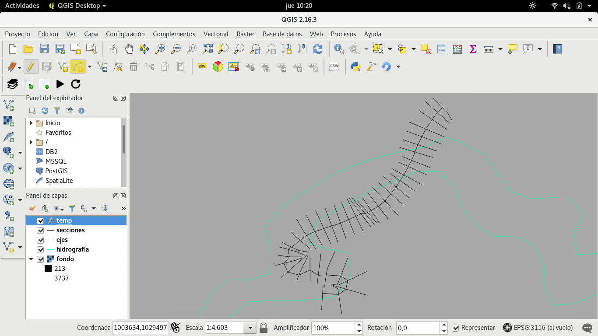
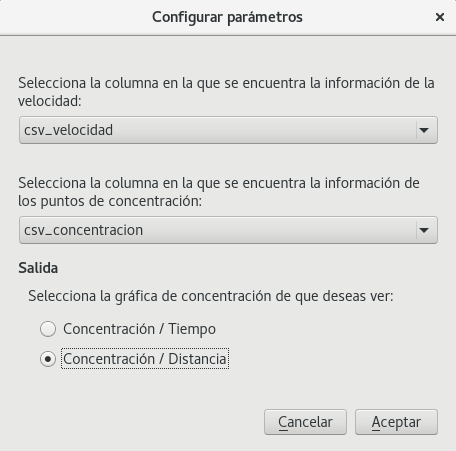

Manual de usuario
==================

Calidad-CAR es una herramienta para modelar matemáticamente la calidad del agua en los ríos. Esta herramienta asume que el usuario tiene los resultados del modelado del movimiento del agua con la herramienta Hec-Ras.

Una vez instalado el plugin CalidadCAR, el usuario podrá ver la siguiente barra de herramientas:

La cual contiene los siguientes procedimientos que podrá realizar el usuario:

1. `Cargar fondos`_.
2. `Unir CSV`_.
3. `Agregar secciones`_.
4. `Cálcular`_.
5. `Limpiar`_.

*****************
Cargar fondos
*****************

Con esta acción el usuario puede cargar las capas que contienen la información necesaria para que se pueda aplicar el modelo matemático.
Para poder realizar esta operación el usuario tendrá que hacer click en el icono resaltado que se ve en la siguiente imagen.

La cual desplegará el siguiente dialogo en el que el usuario podrá buscar los diferentes archivos en su sistema de archivos, para cargar las capas.

.. image:: images/cargar_fondos_dialogo.png

Una vez seleccionadas todas las capas que el usuario desea cargar, se desplegarán los diálogos correspondientes para solicitar el sistema de coordenadas de cada capa que se va a cargar.

.. image:: images/cargar_fondo_crs.png

Una vez seleccionado el sistema de coordenadas de las capas que se van a cargar, estas se podrán visualizar en el canvas de QGIS, como se ve en la siguiente imagen, para visualizar directamente la capa de secciones, el usuario podrá hacer click en el icono resaltado en la siguiente imagen:

.. image:: images/enfocar_capa_secciones.png

En la siguiente imagen se puede ver el canvas de QGIS una vez el usuario ha realizado un acercamiento a la capa de secciones:

.. image:: images/capa_zoom.png

**************
Unir CSV
**************

Este procedimiento consiste en cargar un archivo CSV, el cual se unirá con la tabla de atributos de la capa de secciones, la cual tendrá que estar cargada, para que el usuario pueda realizar esta operación.

El usuario podrá realizar este procedimiento haciendo click en el icono resaltado en la siguiente imagen:

En la siguiente imagen se puede ver el dialogo que le pedirá al usuario la información necesaria para cargar el archivo CSV, y para poder unirlo con la capa de secciones.

.. image:: images/dialogo_unir_csv.png

Si el usuario desea realizar la unión de otro archivo CSV con la para de secciones, tendrá que repetir el procedimiento que se acabo de describir.

***********************
Agregar secciones
***********************

Haciendo click sobre el botón subrayado en la siguiente imagen el usuario podrá agregar secciones transversales.

Al hacer click sobre el botón de agregar sección se creara una capa de QGIS temporal en la que el usuario podrá dibujar las secciones que deseé, esto le habilitará al usuario el botón de *Añadir cadena circular*, el cual se ve resaltado en la siguiente imagen.

Después de hacer click sobre el click sobre el botón de *Añadir cadena circular* el usuario podrá ubicar los puntos de la cadena, o la sección para dibujarla, como se ve en la siguiente imagen.

.. image:: images/dibujar_seccion.png

En la imagen de arriba se puede ver la sección que se acabó de agregar (La sección con puntos rojos), Apretando el click derecho del mouse se finalizará la operación de agregarle puntos a la sección, y se le desplegará al usuario un diálogo en el cual el podrá ingresar la información relacionada con la sección, como se puede ver en la siguiente imagen.

.. image:: images/informacion_seccion.png

.. note:: Para poder agregar una sección es necesario que el usuario haya cargado previamente la capa de ejes, y la capa de secciones.

.. note:: Es importante que la sección que se va a agregar tenga un punto de intersección con el *eje* de la capa de ejes.

**************
Cálcular
**************

Una vez que el usuario ha ingresado la información necesaria de forma correcta, este podrá hacer click en el icono resaltado en la siguiente imagen, para aplicar el modelo matemático sobre la información.

.. image:: images/accion_calcular.png

Esta acción desplegará el siguiente diálogo que le pedirá al usuario la siguiente información:

- El nombre de la columna en la que se encuentran los valores de velocidad.
- El nombre de la columna en la que se encuentran los valores de los puntos de concentración.
- La gráfica de salida que el usuario desea ver.

Este es un ejemplo de la gráfica de salida de Concentración con respecto a la distancia.

.. image:: images/salida.png

.. note:: Cuando el manual se refiere a el nombre de la columna de velocidad, o de puntos de concentración se asume que el usuario cargo esta información en un archivo CSV, realizando la operación de Unir CSV

**************
Limpiar
**************

Al hacer click en el botón resaltado en la siguiente imagen el usuario limpiara el espacio de trabajo, cerrando las capas cargadas, en caso que deseé realizar el mismo proceso con capas diferentes.

.. image:: images/accion_recargar.png

.. note:: El usuario puede descargar archivos de prueba del siguiente enlace_. para probar el plugin. En este vídeo_. se puede ver el funcionamiento del plugin con esta información de prueba.

.. _enlace: https://drive.google.com/file/d/0B-rl9rYMVpHpaUh6X1FfLThxYkU/view?usp=sharing
.. _vídeo: https://www.youtube.com/watch?v=5JpgidErg-E
